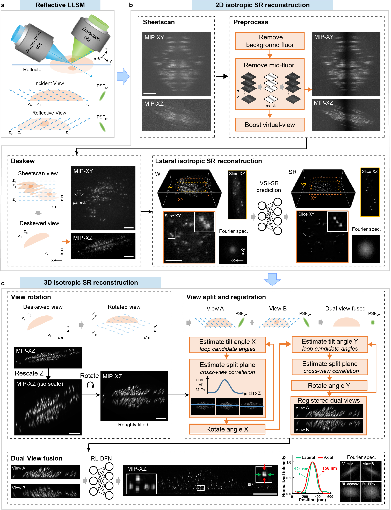
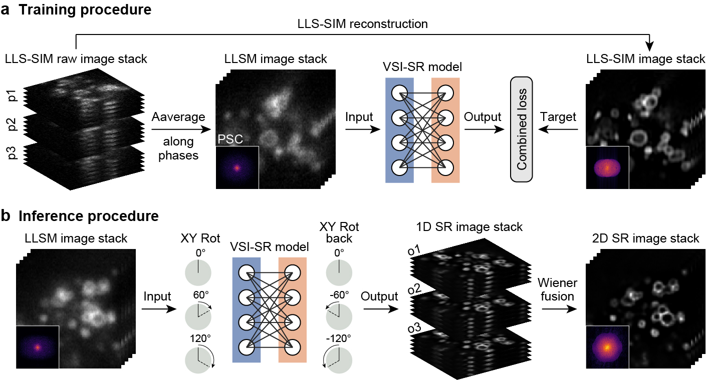
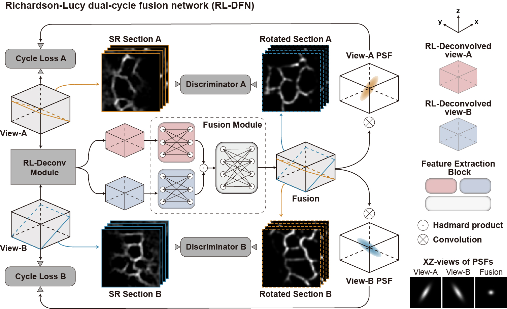
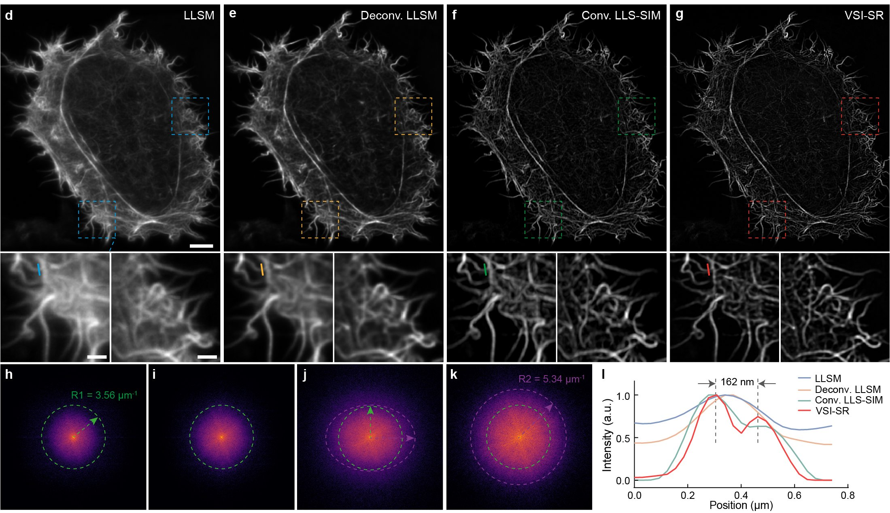
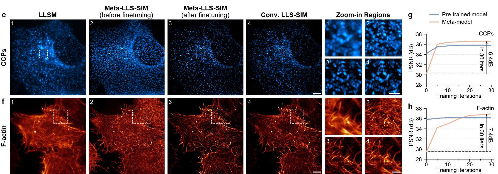
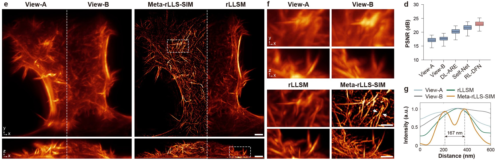
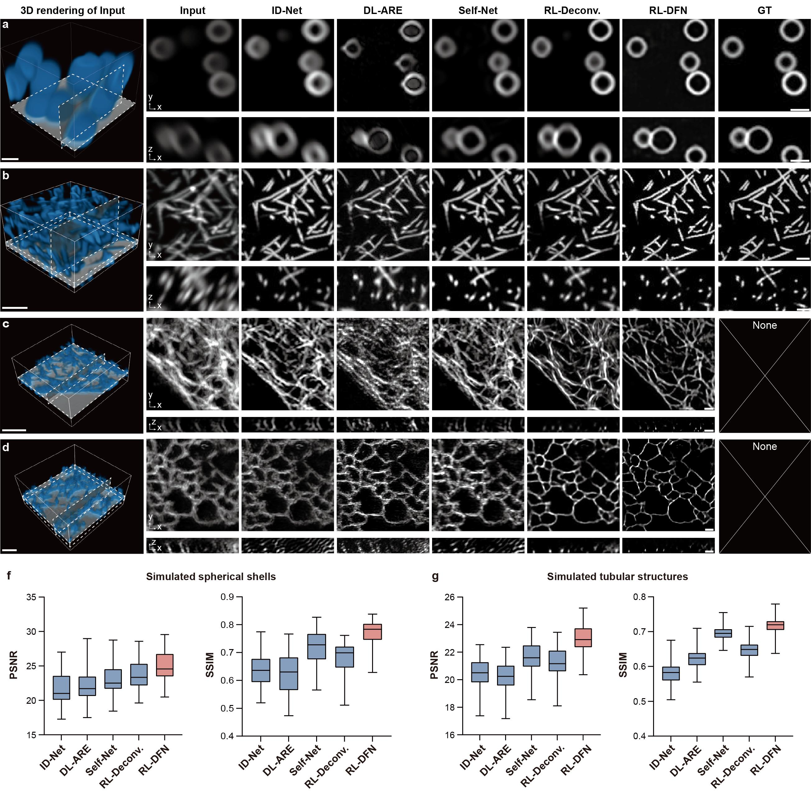

# **Meta-rLLSM-VSIM: Meta Learning-Empowered Reflective Lattice Light-Sheet Virtual Structured Illumination Microscopy**
This is a repository of the source codes for paper [*Fast adaptive super-resolution lattice light-sheet microscopy for rapid, long-term, near-isotropic subcellular imaging*](https://www.biorxiv.org/content/10.1101/2024.05.09.593386v2).


<!-- TOC -->
* ✨ [Method](#Method-Overview)
* ⚙️ [Environment](#Environment)
* 📦 [Demo Data&Pretrained Model](#Demo-Data&Pretrained-Model)
* 🔰 [Pipeline](#Pipeline)
* 💡 [Model](#Model)
* 📊  [Results](#Results)
<!-- TOC -->

<br><br>
<h1 id="Method-Overview">✨ Method Overview</h1>

In this paper, we present the meta learning-empowered reflective lattice light-sheet virtual structured illumination microscopy (Meta-rLLS-VSIM), which instantly upgrades LLSM to a near-isotropic super resolution of ∼120-nm laterally and ~160-nm axially, more than twofold improvement in each dimension, without any modification of the optical system or sacrifice of other imaging metrics. We provide here the tutorial of the implementation of Meta-rLLSM-VSIM, including the environment configuration and the overall pipeline of Meta-rLLSM-VSIM reconstruction.

<p align="center">

</p>


<br><br>
<h1 id="Environment">⚙️ Environment</h1>

The cource codes were mainly constructed by Python and PyTorch under an environment of:

```text
python==3.10
pytorch==2.1
cuda==12.1
```
You can install the Pytorch packages by

```shell
pip3 install torch torchvision
```
The necessary packages are contained in the _./requirement.txt_ file. You can install them by
```shell
pip install -r ./requirements.txt
```

If you want to run the cource codes constructed by MATLAB, please use the MATLAB(version > 2017b) with Image Processing Toolbox.


<br><br>
<h1 id="Demo-Data&Pretrained-Model">📦 Demo Data&Pretrained Model</h1>

We have provided __Demo Data__ and __Pretrained Model__ at [Zenodo](https://doi.org/10.5281/zenodo.13486221). You can load __Demo Data__ and __Pretrained Model__ from our [Zenodo Dashboard](https://doi.org/10.5281/zenodo.13486221) and save them follow the notes.
```
a. Demo_Data_for_VSI_SR.zip
If you want to run the Demo Case in our source code of VSI-SR model, please load this dataset and save it under ./Code_for_2D_IsoRecon/Demo_Data_for_VSI_SR.

b.  Demo_Data_for_RL_DFN.zip
If you want to run the Demo Case in our source code of RL-DFN model, please load this dataset and save it under ./Code_for_3D_IsoRecon/data.

c. Demo_Data_for_3D_IsoRecon.zip
If you want to run the Demo Case in our source code of 3D IsoRecon pipeline model, please load this dataset and save it under ./Demo_Data_for_3D_IsoRecon.

d. Pretrained_Model_RL_DFN.zip
If you want to run the Demo Case in our source code of RL-DFN model, please load this dataset and save it under ./Code_for_3D_IsoRecon/pretrained_model.
```

<br><br>
<h1 id="Pipeline">🔰 Pipeline of 3D Isotropic Reconstruction</h1>

The integrated pipeline of 3D isotropic reconstruction is developed to reconstruct a near-isotropic SR image stack from the corresponding reflective lattice light-sheet microscopy (rLLSM) acquisitions, which consists of four major steps: (1) Apply a two-step background removal algorithm and deskew the stack into the deskewed view to preserve the spatial continuity of the sample structure; (2) The deskewed stack is sent to the Meta-VSI-SR model for laterally isotropic SR reconstruction; (3) The stack after 2D isotropic SR reconstruction is split into dual views by rotation and registration; and (4) finally, the registered dual-view stacks are fused via the proposed RL-DFN. The schematic workflow of Meta-rLLSM-VSIM is shown below.

<p align="center">

</p>

In this repository, we provide a raw rLLSM image stack of F-actin as a simple demo to help users go through the 3D isotropic reconstruction pipeline.

## **Step1: Background removal and Deskew**
The raw rLLSM image stack is first preprocessed with a MATLAB script _./Workflow_of_Meta_rLLSM_VSIM_Recon/Step1_BackgroundRM_and_Deskew.m_ to remove epi-fluoresence and perform deskew. The key parameters that are needed to pay special attention here are shown below:

```python
channel='488'
celllabel='F-actin/'
Data_path='/Demo_Data_for_3D_IsoRecon/data/' #The path to raw_data
Save_path='/Demo_Data_for_3D_IsoRecon/step1/' #The path to save
```
Under the classification of __*celllabel*__ and __*channel*__, the stack has been removed epi-fluoresence and deskewed will be saved in _./Demo_Data_for_3D_IsoRecon/step1/Factin/488_ . 
## **Step2: Laterally isotropic SR reconstruction**
After background removal and deskew, the image stack are then reconstructed into a laterally isotropic SR volume using the Meta-VSI-SR model (detailed in [here](#Meta-VSI-SR)). The codes of laterall isotropic reconstruction are arranged in folder _./Code_for_2D_IsoRecon_. To apply laterally isotropic SR reconstruction, run the following command:

```shell
python Workflow_of_Meta_rLLSM_VSIM_Recon/Step2_2D_Isotropic_Recon.py \
--Data_path="/Demo_Data_for_3D_IsoRecon/step1/F-actin/488" \
--Save_path="/Demo_Data_for_3D_IsoRecon/step2"  \
--model_path="/Code_for_2D_IsoRecon/finetuned_model/Factin/F-actin.pth"
```
After laterally isotropic SR reconstruction, the image stack is placed at _./Demo_Data_for_3D_IsoRecon/step2/recon/0001_, where _0001_ denotes the time point. The raw data and single direction SR data with 3 orientations (0, 60, 120 degrees) are stored in _./Demo_Data_for_3D_IsoRecon/step2/origin_rotation/_ and _./Demo_Data_for_3D_IsoRecon/step2/sr_rotation/_ respectively .

## **Step3: Rotation and registration**
The stacks after laterall isotropic SR reconstruction are split into two views using a MATLAB script _./Workflow_of_Meta_rLLSM_VSIM_Recon/Step3_Rotation_and_Calibration.m_. The rotation process need the design angle between the detection objective and coverslip, which is 30.8 degrees in our setup. The key parameters that are needed to pay special attention here are shown below:

```python
Data_path='/Demo_Data_for_3D_IsoRecon/step2/recon/0001/F-actin.tif' #The dual-view data wait to be split
Save_path='/Demo_Data_for_3D_IsoRecon/step3' #The path to save
RotAngle_Y=30.8  #The design angle between the detection objective and coverslip
```
Then, the dual-view splitting results are saved as two TIFF files in _./Demo_Data_for_3D_IsoRecon/step3_.
If you want to get more accurate registration results, you can expand the rotation range of the image around the X axis and Y axis during registration by adjusting parameter __*Range_x_rot*__ and __*Range_y_rot*__.

## **Step4: Dual-View Fusion**
Till now, two complementary views with laterally istropic super resolution have been generated from the raw rLLSM data volume, which will be fused into a final isotropic SR volume with the RL-DFN model (detailed in [here](#RL-DFN)). The codes of dual-view fusion are placed at  _./Code_for_3D_IsoRecon_. To apply the RL-DFN to generate the final isotropic SR volume, run the following command:
```shell
python Workflow_of_Meta_rLLSM_VSIM_Recon/Step4_3D_Isotropic_Recon.py \
--Data_path="/Demo_Data_for_3D_IsoRecon/step3" \
--Save_path="/Demo_Data_for_3D_IsoRecon/step4" \
--model_path="/Code_for_3D_IsoRecon/pretrained_model/F-actin/"
```

Afterwards, the 3D near-isotropic reconstruction result will be saved in _/Demo_Data_for_3D_IsoRecon/step4_.

<br><br>
<h1 id="Model">💡 Model Training and Testing</h1>

There are two deep learning model in the process of 3D isotropic reconstruction. One is the meta-learning empowered virtual structured illumination super-resolution ([Meta-VSI-SR](#Meta-VSI-SR)) model which can realize isotropic super-resolution reconstruction in lateral. The other is the dubbed Richardson-Lucy dual-cycle fusion network ([RL-DFN](#RL-DFN)) which fuses two data views captured by the rLLSM system (before or after processed by the VSI-SR model) with comlementary resolution into an isotropic data volume.

We provide here the tutorial of the implementation of Meta-VSI-SR and RL-DFN, you can follow the instructions to run the training, finetune and testing demo code.

<!-- TOC -->
* [2D Isotropic Reconstruction via Meta-VSI-SR](#Meta-VSI-SR)
* [3D Isotropic Reconstruction via RL-DFN](#RL-DFN)
<!-- TOC -->

<br><br>
<h2 id="Meta-VSI-SR">2D Isotropic Reconstruction via Meta-VSI-SR</h2>
The meta-learning empowered virtual structured illumination super-resolution (Meta-VSI-SR) model is designed to realize isotropic super-resolution reconstruction in lateral. Briefly, the Meta-VSI-SR scheme is implemented following three steps: (1) Acquire the training dataset using SI mode of the LLS-SIM system and finetune the pre-trained Meta-VSI-SR model into a structure and SNR specific VSI-SR model; (2) Apply the finetuned model onto the raw data that is rotated to three orientations equally spaced by 60°, hence generating three anisotropic SR components; and (3) Combine the different components through a Wiener-based joint deconvolution algorithm in the Fourier space. The schematic illustrations of the training and inference of VSI-SR model are shown below. 


<p align="center">

</p>

It is noteworthy that the meta-training scheme endows the Meta-LLS-VSIM and VSI-SR model with a fast adaptation capability when applied on an unseen biological specimen, because the Meta-VSI-SR model is able to adapt to a new specimen within a few training iterations on a small sort of training data. Once the specimen-specific model has been finetuned, it can be applied on other data of the same biologcial structure. Codes of meta-training, meta-finetuning, and inference with the Meta-VSI-SR model are contained in _./Code_for_2D_IsoRecon_.

### **Folder Structure**
Folder structure of the _./Code_for_2D_IsoRecon_ are shown and explained below:
- data: dataset for training or finetuning
- Demo_Data_for_VSI_SR: demo data used for finetuning and laterally isotropic SR reconstruction
- trained_meta_model: a pre-trained Meta-VSI-SR model ready for finetuning
- meta_rcan: save the checkpoints and logs of a training model
- finetuned_model: a VSI-SR model after meta-finetuning
- training_data_preparation_matlab: preprocessing for training data and finetuning data in matlab
- model: python source files of VSI-SR network
- utils: python source files of utils

### **Laterally isotropic SR reconstruction using VSI-SR models**
Given a well-trained or a finetuned (from the Meta-VSI-SR model) VSI-SR model, a diffraction-limited LLSM image stack can be instantly reconstructed into a laterally isotropic SR counterpart following the inference procedure shown in Fig. 2b.
Here we provide a VSI-SR model finetuned with F-actin data from the Meta-VSI-SR model as well as an assortative python script to perform the laterally isotropic SR reconstruction for a LLSM F-actin data, which can be executed by:

```shell
python Code_for_2D_IsoRecon/Test_VSI_SR.py \
--Data_path='/Code_for_2D_IsoRecon/Demo_Data_for_VSI_SR/Lattice-SIM/16_F-actin_20210118-0121-hela-lifeact/cell25-488_20210118_202347' \
--Save_path='/Code_for_2D_IsoRecon/data/recon_result/F-actin' \
--model_path='/Code_for_2D_IsoRecon/finetuned_model/Factin/F-actin.pth'
```
You can get the image stack of F-actin after laterally isotropic SR reconstruction from _./Code_for_2D_IsoRecon/data/recon_result/F-actin_. If you want to
process your own F-actin data, please change __*Data_path*__ to the path of your own LLSM image stacks.

### **Meta-finetuning from a pre-trained Meta-VSI-SR model**
If users would like to process data of a new type of biological specimen, a new VSI-SR model can be rapidly generated via meta-finetuning process from a pre-trained Meta-VSI-SR model using a few training dataset. Typically, we utilize data captured from 3 cells/ROIs as the finetuning dataset, in which two cells are used for finetuning and one cell for validation. The raw data used for finetuning should be organized in folder _./Code_for_2D_IsoRecon/DemoData_for_VSI_SR_Finetune_ as below:
```text
｜-- Lattice-SIM
          | -- Struct1
          | -- Struct2
          | -- Struct3
                  | -- Cell1
                  | -- Cell2
                  | --  ···
```
We provide examplar data of CCPs and  F-actin for executing the finetuning process as a demo. Following these steps to finetune a Meta-VSI-SR model:

#### **Data Preparation**
The raw data for finetuning should be at first preprocessed and augmented into finetuning dataset, which consists of ~1000 LLSM/LLS-SIM patch pairs. The preprocessing operation includes deskew, background removal, Gaussian filtering for LLS-SIM images, and image stack normalization. The augmentation is performed via random cropping without rotaiton or flipping. Above data preparation can be accomplished by running the MATLAB script _./Code_for_2D_IsoRecon/Data_Prepare.m_ with the cell used for testing specified. The key parameters that are needed to pay special attention are shown below:
```python
flag_make_training_data = false #flag of making training dataset
flag_make_finetuning_data = true #flag of making finetuning dataset
Data_path = '/Code_for_2D_IsoRecon/Demo_Data_for_VSI_SR/Lattice-SIM' #raw data path
Save_path = '/Code_for_2D_IsoRecon/data' #save path for processed LLSM
```
The preprocessed data is organized into finetuning dataset which is placed at _/Code_for_2D_IsoRecon/data/finetune_.

#### **Finetuning meta-VSI-SR**
After data preparation, the finetuning process of the Meta-VSI-SR model can be executed by running the following command. Of note, during the finetuning process, the specified testing data will be processed at set intervals to screen the progression of the VSI-SR model.

```shell
python Code_for_2D_IsoRecon/Finetune_VSI_SR.py \
--Data_path="/Code_for_2D_IsoRecon/data/finetune" \
--Save_path="/Code_for_2D_IsoRecon/meta_rcan/finetune" \
--model_path="/Code_for_2D_IsoRecon/trained_meta_model/meta_model.pth"
```
The model after finetuning will be saved in _/Code_for_2D_IsoRecon/meta_rcan/finetune_, and you can apply it on data of the new type of biological specimen to realize laterally isotropic SR reconstruction.


### **Train a new Meta-VSI-SR model**
The Meta-VSI-SR model is trained based on a modified model-agnostic meta-learning (MAML) algorithm. If you want to train a new Meta-VSI-SR model, please follow these steps:

#### **Data Preparation**

The data preparation of meta-training contains following steps: (i) applying deskew to all LLSM images (averaged from the raw LLS-SIM images) and their corresponding GT LLS-SIM images; (ii) removing the camera background, i.e., ~100 sCMOS counts, for LLSM images and applying a 2D Gaussian filter for GT LLS-SIM images to slightly suppress the noise-induced reconstruction artifacts; (iii) normalizing all images to [0,1]. Then, the whole dataset was augmented into tens of thousands of image patch pairs of LLSM patches (64×64×7 voxels) and their corresponding GT LLS-SIM patches (96×96×3 voxels), that is, ~3,000 pairs for each task. Above data preparation can be accomplished by running the MATLAB script _./Code_for_2D_IsoRecon/Data_Prepare.m_. The key parameters that are needed to pay special attention are specified below:

```python
flag_make_training_data = true #flag of making training dataset
flag_make_finetuning_data = false #flag of making finetuning dataset
Data_path = '/Code_for_2D_IsoRecon/Demo_Data_for_VSI_SR/Lattice-SIM' #raw data path
Save_path = '/Code_for_2D_IsoRecon/data' #save path for processed LLSM
```
The preprocessed data is organized into training dataset which is placed at _/Code_for_2D_IsoRecon/data/train_.

#### **Train Meta-VSI-SR model**
After data preparation, run the following command to train a new Meta-VSI-SR model:

```shell
python  Code_for_2D_IsoRecon/Train_meta_VSI_SR.py  \
--Data_path='/Code_for_2D_IsoRecon/data/train' \
--Save_path='/Code_for_2D_IsoRecon/meta_rcan'
```

If you have multiple GPU devices, you can accelerate meta training with _/Code_for_2D_IsoRecon/Train_Meta_VSI_SR_DDP_version.py_, which is the data distributed parallel (DDP) version of meta-training. The well-trained meta-model will be saved in _./Code_for_2D_IsoRecon/meta_rcan_.
<br><br><br>

<h1 id="RL-DFN">3D Isotropic Reconstruction via RL-DFN</h1>

We devised a self-supervised dual-view fusion algorithm, dubbed Richardson-Lucy dual-cycle fusion network (RL-DFN) that incorporated the multi-view Richardson-Lucy (RL) iteration and deterministic point spread function (PSF) priors into the network architecture and loss design. The RL-DFN is used to fuse two data views captured by the rLLSM system (before or after processed by the VSI-SR model) with comlementary resolution into an isotropic data volume. The network architecture of RL-DFN is shown in Fig. 3.

<p align="center">

</p>

 
### **Folder Structure**
Codes of RL-DFN are contained in _./Code_for_3D_IsoRecon_. Its structure is shown and explained below:
- data: data for training or testing and testing result
- models: python source files of RL-DFN network architecture
- PSFs: save the corrsponding PSF files referred to view-A and view-B
- pretrained_model:the model pretrained for 3D isotropic reconstruction
- train_RL_DFN: model's logs, checkpoints and visualization results during training
- utils: python source files of utils

### **Testing**
We provide a pre-trained RL-DFN model trained with F-actin dataset for a simple demo, which is placed at _./pretrained_model/F-actin_. You can test this pre-traiend RL-DFN model following these steps:

#### **Data Preparation**
In that the RL-DFN incorporates RL deconvolution iteration into its forward processing model, the corrsponding PSF files referred to view-A and view-B should be provided in _./Code_for_3D_IsoRecon/PSFs_. And the dual-view data to be fused should be placed at _./Code_for_3D_IsoRecon/data/TestData_ and organized as below:
```text
｜-- TestData
          | -- Struct1
          | -- Struct2
                  | -- ViewA
                         | -- tp001.tif
                         | -- tp002.tif
                         | -- ···
                  | -- ViewB
                         | -- tp001.tif
                         | -- tp002.tif
                         | -- ···
``` 
where the _Struct_ denotes the type of biological specimen. The image stacks of View-A and View-B need to be respectively placed under _TestData/Struct/ViewA/_ and _TestData/Struct/ViewB/_. Two views' data at the same time point should have the same file name.
#### **Testing RL-DFN**
Then use following command to run the pre-trained RL-DFN model:

```shell
python Code_for_3D_IsoRecon/test_RL_DFN.py \
--Data_path="/Code_for_3D_IsoRecon/data/TestData/F-actin" \
--Save_path="/Code_for_3D_IsoRecon/data/result" \
--model_path="/Code_for_3D_IsoRecon/pretrained_model/F-actin/"
```
Afterwards, the 3D near-isotropic reconstruction result will be saved in _./Code_for_3D_IsoRecon/data/result_.

### **Train**
The RL-DFN model can be trained in a self-supervised manner using the data to be fused themselves. A new RL-DFN model can be trained following these steps:

#### **Data Preparation**
Similar to the inference procedure, the corrsponding PSF files referred to view-A and view-B should be provided in _./Code_for_3D_IsoRecon/PSFs_. And the dual-view training data should be placed at _./Code_for_3D_IsoRecon/data/TrainData_ and organized as below:

```text
｜-- TrainData
          | -- Struct1
          | -- Struct2
                  | -- ViewA
                         | -- tp001.tif
                         | -- tp002.tif
                         | -- ···
                  | -- ViewB
                         | -- tp001.tif
                         | -- tp002.tif
                         | -- ···
``` 
where the _Struct_ denotes the type of biological specimen. The image stacks of View-A and View-B need to be respectively placed under _TrainData/Struct/ViewA/_ and _TrainData/Struct/ViewB/_. Two views' data at the same time point should have the same file name.

#### **Train RL-DFN model**
After the data preparation, a new RL-DFN model can be trained by using follow command:

```shell
python Code_for_3D_IsoRecon/train_RL_DFN.py \
--Data_path="/Code_for_3D_IsoRecon/data/TrainData" \
--Save_path="/Code_for_3D_IsoRecon/train_RL_DFN"  
```

You select specific type of biological specimen by setting the parameter __*Struct*__. The well-trained Rl-DFN model will be saved in _./Code_for_3D_IsoRecon/train_RL_DFN_.

<br><br>
<h1 id="Results">📊  Results</h1>

## 1. Comparison with LLSM, Deconv. LLSM, Conv. LLS-SIM
<p align="center">

</p>

## 2. Fast adaptation performance of meta-VSI-SR
<p align="center">

</p>

## 3. 4D SR live imaging by Meta-LLS-VSIM
<p align="center">

</p>

## 4. Dramatically improves resolution in all dimensions via Meta-rLLS-VSIM
<p align="center">

</p>

## 5. Comparison with existing axial resolution enhancement methods
<p align="center">

</p>


